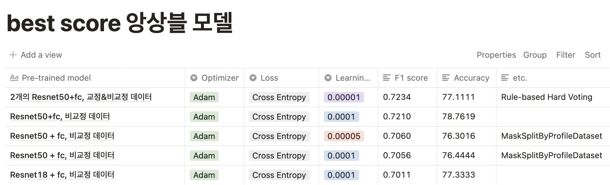

# P stage L1 - Image Classification Project

## 📝 프로젝트 주제

- 마스크 착용 상태 분류
    - 카메라로 촬영한 사람 얼굴 이미지의 마스크 착용 여부를 판단하는 Task
    - 사람의 성별, 연령대, 마스크 착용 여부를 한꺼번에 추론하여 총 18개의 class로 판정

## 📝 프로젝트 설명

- <b>배경</b>
    - Covid-19의 확산으로 감염 확산 방지를 위해 마스크 착용이 의무화
        - 따라서 공공 장소에 있는 사람들은 반드시 마스크를 착용해야 할 필요가 있음.
        - 또 코와 입을 완전히 가릴 수 있도록 올바르게 착용하는 것이 중요
    - 하지만 넓은 공공장소에서 모든 사람들의 올바른 마스크 착용 상태를 검사하기 위해선 추가 인적 자원이 필요
        - 따라서 사람 얼굴 이미지 만으로 이 사람이 마스크를 쓰고 있는지, 정확히 쓴 것이 맞는지 자동으로 가려낼 시스템을 만들어 내 보려고 함
- <b>목표</b>
    - CNN 모델을 활용해 Image Classification Task를 수행
- <b>평가</b>
    - f1 score (macro)

## 🔥 Final Score

|  | Public | Private |
| --- | --- | --- |
| F1 Score | 0.7264 | 0.7107 |
| Accuracy | 78.5397 | 77.6349 |

- 선정 모델: `Resnet50`
- 가중치 초기화: `Xavier`
   - [Xavier-uniform-notion-정리](https://www.notion.so/Xavier-uniform-3e4d82d0869a4a89a8e033232d45c12e)

- 모델 선정 및 분석

- best top-5 모델의 결과에 대해 hard-voting 수행 ⇒ 최종 f1 score `0.7264 => 0.7107`   accuracy `78.5397 => 77.6349`

### 모델 평가 및 개선

- 결과 분석
    - 나이: 노인을 제대로 판별 못하는 경우가 대부분이었음.
    - 성별: 여성이 자주 입는 복장과 그 색을 학습해버려, 그런 패턴의 옷을 입은 남성을 여성이라 판정하는 경우가 있었음
    - 마스크: Incorrect 판별에 다소 어려움이 있었음.
- 개선 방향
    - Oversampling으로 클래스간 불균형을 줄이고, 확률적 Augmentation을 도입하여 overfitting 방지 → 의도는 좋았으나, 결과가 좋지 못했음
    - Ensemble 기법 중 Hard Voting을 사용 → F1 스코어 상승

# 🖼 Wrap Up REPORT

[[Notion] Wrap-Up-Report](https://hyunbool.notion.site/Wrap-Up-f90798f5110543a6a669a6f6b3ad3909)

- 사용 데이터셋 구조도, EDA 등 결과 공유
- 개인 회고 기록

## GitHub 폴더 및 프로젝트 구조

- GitHub 폴더 구조
    - `special_mission` : 대회 기간 동안의 실험 및 작업 폴더
    - `final_submission` : 최종 작업물

- 각 프로젝트 구조
    - `dataset.py` : 입력 데이터셋과 출력 데이터셋
    - `train.py` : 모델 학습
    - `model.py` : 모델 구조
    - `loss.py` : 학습을 위한 loss 함수
    - `inference.py` : 클래스 추론
    - `sample_submission.py` : EDA 등 실험

## 프로젝트 팀 구성 및 역할

- 김준재: 프로젝트 개발(모델 튜닝), 데이터 분할 개선, Validation Metric 개선
- 김현아: 프로젝트 개발(설계 및 실험), transform 실험, PCA 시도
- 배현진: 프로젝트 개발(데이터, 앙상블 모델 실험), 실험 추적
- 이강민: 프로젝트 개발 (모델 튜닝 및 실험, wandb 기본 셋팅)

## 활용 장비 및 재료(개발 환경, 협업 tool 등)

- 개발 환경: Ubuntu 18.04.5 LTS
    - 장비: V100
    - IDE: VS Code, Jupyter Notebook
- 협업
    - Notion: 로그 기록 및 인사이트 공유
    - Github: 코드 관리 및 공유
    - Slack: 일정 공유
    - Zoom: 회의 및 인사이트 공유
    - WandB: 실험 결과, Metric 정보 공유

